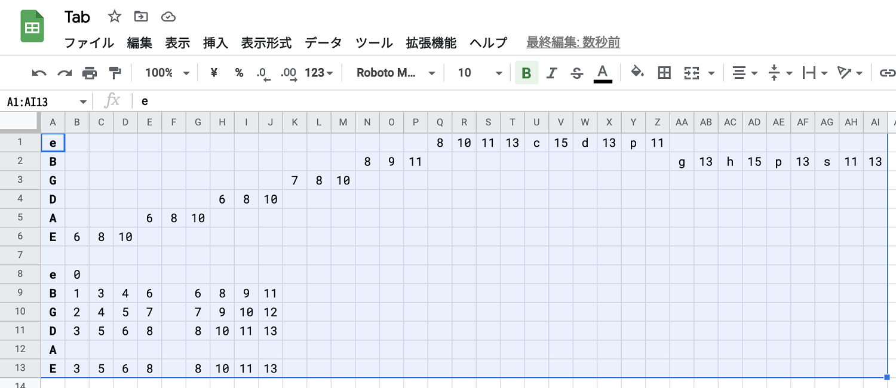
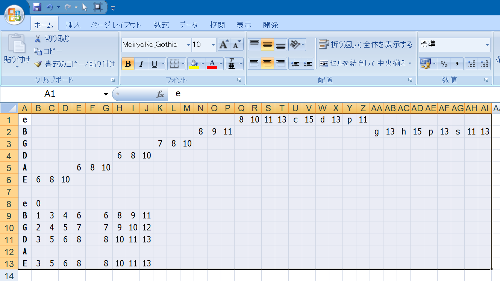

# @neos21/tab2tab : Tab2Tab

[](https://www.npmjs.com/package/@neos21/tab2tab) [](https://github.com/Neos21/tab2tab/packages/1565449)

タブ文字で区切られた「ギタータブ譜」のテキストを、ハイフンで整形したタブ譜に変換する。


## Demo

__[Demo (GitHub Pages)](https://neos21.github.io/tab2tab/)__


## How To Use

### ギタータブ譜を書く

予め Excel や Google Spread Sheets などで「ギタータブ譜」を書き、それをコピーしたテキスト = **タブ区切りのタブ譜** を利用する。

- Excel
    - 
- Google Spread Sheets
    - 

### CLI ツールとして使用する

```bash
$ npm install -g @neos21/tab2tab

# タブ区切りのタブ譜のテキストファイルを用意する
$ cat ./input.txt
e																8	10	11	13	c	15	d	13	p	11									
B													8	9	11											g	13	h	15	p	13	s	11	13
G										7	8	10																						
D							6	8	10																									
A				6	8	10																												
E	6	8	10																															

# コマンドを実行すると、次のようにハイフンで整形されたタブ譜になる
$ tab2tab ./input.txt
|e|------------------------------------8-10-11-13c15d13p11-----------------|
|B|-----------------------------8-9-11---------------------g13h15p13s11-13-|
|G|----------------------7-8-10--------------------------------------------|
|D|---------------6-8-10---------------------------------------------------|
|A|--------6-8-10----------------------------------------------------------|
|E|-6-8-10-----------------------------------------------------------------|
```

### Node.js API として利用する

```bash
$ npm install --save @neos21/tab2tab
```

```javascript
const fs      = require('fs');
const tab2tab = require('@neos21/tab2tab');

const text = fs.readFileSync('./input.txt', 'utf-8');  // タブ区切りのタブ譜を用意する
const tab  = tab2tab(text);
console.log(tab);
```

### ブラウザで利用する

- [jsDelivr](https://www.jsdelivr.com/package/npm/@neos21/tab2tab)
- unpkg.org : `https://unpkg.com/browse/@neos21/tab2tab@【Latest Version】/`
- [GitHub Pages](https://neos21.github.io/tab2tab/)
    - <https://neos21.github.io/tab2tab/tab2tab.js>
- [Raw GitHub](https://github.com/Neos21/tab2tab)
    - <https://raw.githubusercontent.com/Neos21/tab2tab/master/index.js>

```html
<!-- JS を読み込む -->
<script src="index.js"></script>

<script>
  const text = document.getElementById('textarea').value;  // タブ区切りのタブ譜を用意する
  const tab = window.tab2tab();
  console.log(tab);
</script>
```


## Links

- [Neo's World](https://neos21.net/)
- [GitHub - Neos21](https://github.com/Neos21/)
- [GitHub - tab2tab](https://github.com/Neos21/tab2tab)
- [GitHub Pages - @neos21/tab2tab : Tab2Tab](https://neos21.github.io/tab2tab)
- [npm - @neos21/tab2tab](https://www.npmjs.com/package/@neos21/tab2tab)
